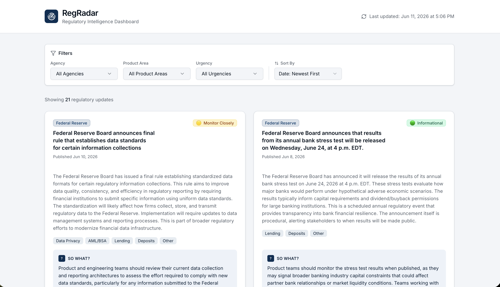

# RegRadar: Regulatory Intelligence Agent

Real-time federal regulatory monitoring powered by Agentic AI.

## Overview

RegRadar automatically monitors 4 federal regulatory sources daily, analyzes updates with Claude AI, and surfaces priority items through an interactive dashboard. Built with n8n, Claude, Airtable, and v0.dev.

## Features

- **Daily Automated Monitoring** - Tracks 4 federal regulators (CFPB, Federal Reserve, NACHA, PCISSC)
- **AI-Powered Analysis** - Claude structurally summarizes each update, tags product areas, and classifies urgency
- **Smart Prioritization** - Keyword-based override logic auto-flags enforcement actions and regulatory violations
- **Interactive Dashboard** - Real-time filtering, sorting, and Airtable sync
- **Production-Ready** - Full end-to-end automation with error handling and logging

## Tech Stack

- **Orchestration:** n8n (workflow automation)
- **AI Analysis:** Claude API (Anthropic)
- **Data Storage:** Airtable
- **Frontend:** v0.dev (React/TypeScript)

## Architecture
RSS Feeds (4x)
↓
n8n Workflow (merge, filter, analyze)
↓
Claude API (structured analysis)
↓
Airtable (structured storage)
↓
v0 Dashboard (interactive UI)

## Quick Start

### Prerequisites
- n8n instance (local or cloud)
- Claude API key (get one at https://console.anthropic.com)
- Airtable account
- v0.dev account (optional for dashboard)

### Setup Instructions
See [docs/SETUP.md](docs/SETUP.md) for detailed step-by-step setup.

## Project Structure
regradar/
├── README.md                    (this file)
├── n8n/
│   ├── workflow-export.json     (n8n workflow)
│   └── WORKFLOW_SETUP.md        (how to import)
├── claude/
│   └── system-prompt.md         (AI analysis prompt)
├── airtable/
│   └── SCHEMA.md                (database structure)
├── dashboard/
│   └── dashboard.jsx            (React component)
└── docs/
├── ARCHITECTURE.md          (system design)
├── SETUP.md                 (installation guide)
└── KEYWORD_LOGIC.md         (urgency override logic)

## Regulatory Sources

| Source | Feed Status | Type |
|--------|-------------|------|
| CFPB | ✅ Active | RSS |
| Federal Reserve | ✅ Active | RSS |
| NACHA | ✅ Active | RSS |
| PCISSC | ⚠️ Connected | RSS |

## Key Concepts

### Urgency Classification
- **Action Required** (🔴) - Enforcement actions, civil penalties, final rules
- **Monitor Closely** (🟡) - Proposed rules, examination findings, supervisory actions
- **Informational** (🟢) - Guidance, best practices, policy statements

### Product Areas
Regulatory updates are tagged across: Payments, Deposits, Lending, Card Issuance, Digital Onboarding, AML/BSA, Consumer Protection, Data Privacy

## How It Works

1. **Daily Trigger** - n8n workflow runs at 7am EST
2. **Data Ingestion** - Pulls latest updates from 4 RSS feeds
3. **Filtering** - Removes empty/duplicate items
4. **AI Analysis** - Claude analyzes each update:
   - Generates executive summary
   - Identifies product areas affected
   - Classifies urgency level
   - Provides "so what" for product teams
5. **Smart Override** - Keyword logic auto-escalates high-risk items
6. **Storage** - Structured data saved to Airtable
7. **Display** - Dashboard syncs in real-time for team access

## Live Demo

**[View RegRadar Dashboard](https://v0-regradar-dashboard.vercel.app/)**

The dashboard displays real regulatory updates from federal sources (CFPB, Federal Reserve, NACHA, PCISSC), analyzed with Claude AI for urgency and product impact, and synced from Airtable in real-time.

## Files & Documentation

- **[docs/ARCHITECTURE.md](docs/ARCHITECTURE.md)** - Detailed system design and data flow
- **[docs/SETUP.md](docs/SETUP.md)** - Step-by-step installation and configuration
- **[docs/KEYWORD_LOGIC.md](docs/KEYWORD_LOGIC.md)** - Explanation of urgency override keywords
- **[n8n/WORKFLOW_SETUP.md](n8n/WORKFLOW_SETUP.md)** - How to import and configure the n8n workflow
- **[claude/system-prompt.md](claude/system-prompt.md)** - Claude system prompt used for analysis
- **[airtable/SCHEMA.md](airtable/SCHEMA.md)** - Airtable base and table structure

## Getting Started

### For Developers
1. Clone this repo
2. Follow [docs/SETUP.md](docs/SETUP.md)
3. Import the n8n workflow
4. Set up Airtable base
5. Deploy dashboard

### For Product Managers
1. Review [docs/ARCHITECTURE.md](docs/ARCHITECTURE.md) for system overview
2. Check [airtable/SCHEMA.md](airtable/SCHEMA.md) for data structure
3. Explore the interactive dashboard to see RegRadar in action

## Future Enhancements

- [ ] Add FinCEN, SEC, OCC scraper-based sources
- [ ] Historical archive lookup (3-24 month searches)
- [ ] Email digest delivery
- [ ] Slack integration for real-time alerts
- [ ] Custom keyword configuration UI

## License

MIT License - feel free to use this for your own regulatory monitoring needs.

## Questions?

Open an issue or reach out. Happy to discuss the architecture, setup, or any questions about Agentic AI!
